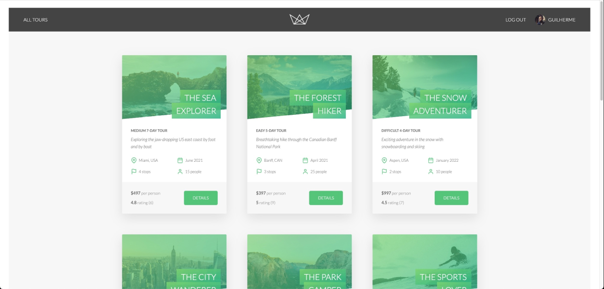

<h1 align="center">
  
</h1>

   
  <h1>Natours website!</h1>
   
   
  <h2>Live at: 
  

   

</h2>

 

 
 
 

Table of Contents

- [About](#about)
- [Built With](#built-with)
- [Future improvements](#future-improvements)
- [License](#license)
- [API Documentation](#api-documentation)

---

## About

<table>
<tr>
<td>

  The early stages of a tour selling company website.

Additional info

 

  This project is the result of taking Jonas Schmedtmann's ["Node.js, Express, MondoDB & More..."]  course. 
  
  The back-end is coded in Node.js using Express and MongoDB. The API docs can be visualized below.
  
  The front-end was, as of now, entirely made out of .pug templates.
  

(<a href="#readme-top">back to top</a>)

---

</td>
</tr>
</table>

## Built With

- [Pug](https://github.com/pugjs/pug)
- [Express](https://github.com/expressjs/express)
- [MongoDB](https://github.com/mongodb/mongo)
- [Mongoose](https://github.com/Automattic/mongoose)
- [axios](https://github.com/axios/axios)
- [Stripe Node.js Library](https://github.com/stripe/stripe-node)

(<a href="#readme-top">back to top</a>)

---

## Future improvements

The project is still in development and the future updates will be guided by the following tasks / improvements:

- [ ] Implementing a Sign Up form
- [ ] Users can only review a Tour that they have actually booked
  - [ ] It includes verifying if the Tour date has already passed
- [ ] Nested Booking routes (/tours/:id/bookings) and (/users/:id/bookings)
- [ ] Date as instances of a Tour (each containing a 'participants' and 'soldOut' fields)
  - [ ] That way, when a user books a Tour, they must select one of the available dates
  - [ ] A new Booking increases the number of participants in the 'date' field until it is fully booked (partipants === maxGroupSize)
- [ ] Implementing advanced authentication features, such as confirming user e-mail address, two-factor authentication, refresh tokens...
- [ ] Adding a review directly from the Tour page
  - [ ] If the logged in user has booked that specific Tour and the Tour date has passed)
- [ ] Hiding the Booking section if the logged in user has already booked that Tour
  - [ ] For the booked date, at least
- [ ] Implementing a "like Tour" functionality (wish-list)
  - [ ] Favorites panel in Account page
- [ ] Implementing 'My Reviews' Page
- [ ] Implementing Admin pages w/ CRUD operations for managing Users, Tours, Reviews and Bookings

(<a href="#readme-top">back to top</a>)

---

## License

This project is licensed under the **MIT license**.

See [LICENSE](LICENSE.txt) for more information.

(<a href="#readme-top">back to top</a>)

---

## API Documentation

See [API Docs](Natours.postman_collection.json) _or_ a live version at [Postman](https://documenter.getpostman.com/view/18687173/VUxPvSq6).

(<a href="#readme-top">back to top</a>)
